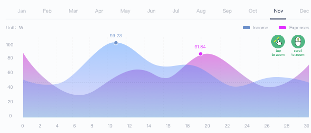

---
# You don't need to edit this file, it's empty on purpose.
# Edit theme's home layout instead if you wanna make some changes
# See: https://jekyllrb.com/docs/themes/#overriding-theme-defaults
layout: default
---

	

	    

	      <ul class="tabs">
	        <li class="tab col s5"><a href="#test1"><h5>Consumption</h5></a></li>
	       	<li class="tab col s5"><a href="#test1"><h5>User Statistics</h5></a></li>
	      </ul>
	    

	    

		    
	    

	 

	 

	 	

	        <input id="date_from" type="text">
	        <label for="date_from" class="">date from</label>
	    

	    

	        <input id="date_to" type="text">
	        <label for="date_to" class="">date to</label>
	    

	    

	       
		          <input id="search" type="search" required>
		          <label for="search"><i class="material-icons">search</i></label>
		          <i class="material-icons">close</i>
	    

	 

	  

	<table class="highlight responsive-table">
		<thead>
			<tr>
				<th>
					<form action="#">
				      <input type="checkbox" id="test" />
				      <label for="test"></label>
					</form>
				
				</th>
				<th>Name</th>
				<th>Account</th>
				<th>Expenditu</th>
				<th>Income</th>
				<th>Balance</th>
				<th>Profit and loss</th>
				<th>Action</th>
			</tr>
		</thead>
		<tbody>
			<tr>
				<td>
					<form action="#">
				      <input type="checkbox" id="test1" />
				      <label for="test1"></label>
					</form>
				</td>
				<td>Belfry Collins</td>
				<td>collins@mixpanel.com</td>
				<td>63.34</td>
				<td>41.17</td>
				<td>22.17</td>
				<td>+35.00%</td>
				<td>
					

						<a class=""><i class="tiny material-icons">mode_edit</i></a>
					    <a class=""><i class="tiny material-icons">delete</i></a>
					

				</td>
			</tr>
			<tr>
				<td>
					<form action="#">
				      <input type="checkbox" id="test2" />
				      <label for="test2"></label>
					</form>
				</td>
				<td>Belfry Collins</td>
				<td>collins@mixpanel.com</td>
				<td>63.34</td>
				<td>41.17</td>
				<td>22.17</td>
				<td>+35.00%</td>
				<td>
					

						<a class=""><i class="tiny material-icons">mode_edit</i></a>
					    <a class=""><i class="tiny material-icons">delete</i></a>
					

				</td>
			</tr>
			<tr>
				<td>
					<form action="#">
				      <input type="checkbox" id="test3" />
				      <label for="test3"></label>
					</form>
				</td>
				<td>Belfry Collins</td>
				<td>collins@mixpanel.com</td>
				<td>63.34</td>
				<td>41.17</td>
				<td>22.17</td>
				<td>+35.00%</td>
				<td>
					

						<a class=""><i class="tiny material-icons">mode_edit</i></a>
					    <a class=""><i class="tiny material-icons">delete</i></a>
					

				</td>
			</tr>
			<tr>
				<td>
					<form action="#">
				      <input type="checkbox" id="test4" />
				      <label for="test4"></label>
					</form>
				</td>
				<td>Belfry Collins</td>
				<td>collins@mixpanel.com</td>
				<td>63.34</td>
				<td>41.17</td>
				<td>22.17</td>
				<td>+35.00%</td>
				<td>
					

						<a class=""><i class="tiny material-icons">mode_edit</i></a>
					    <a class=""><i class="tiny material-icons">delete</i></a>
					

				</td>
			</tr>
		</tbody>			
	  </table>

  

